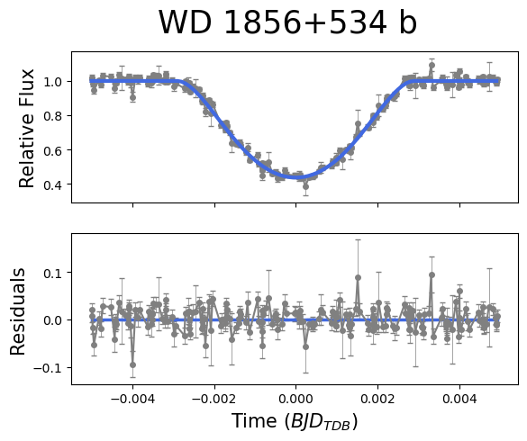
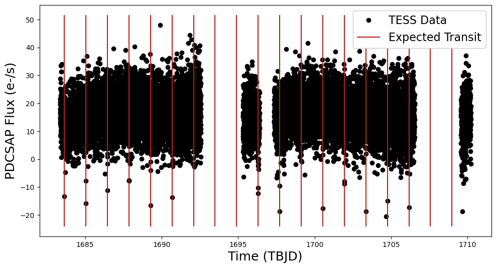

# WD 1856+534 b

## Nickel Data
We observed 17 transits of WD 1856+534b with the 1m Nickel Telescope at Lick Observatory on the following dates. All transits were observed in the R band with 45 second exposures except the 2022-04-01 transit, which was taken in the V band with 45 second exposures, and the 2022-06-02 transit, which was taken in the R band with 120 second exposures. 

- April 1, 2022
- June 2, 2022
- July 31, 2023
- August 14, 2023
- May 13, 2024
- June 6, 2024
- June 13, 2024
- June 23, 2024
- June 30, 2024
- July 7, 2024
- July 14, 2024
- July 24, 2024
- August 7, 2024
- August 14, 2024
- May 17, 2025
- May 24, 2025
- June 7, 2025
- June 17, 2025

## Data Reduction Procedure
- Download flats, biases, and science data from Mount Hamilton data repository (https://mthamilton.ucolick.org/data/)
- Correct FITS file headers with fits_head.py to ensure files are readable by AstroImageJ (AIJ)
- Import science image sequence to AIJ and flip through to make sure there are no obvious problems. Go to Process $\to$ Data reduction facility. In DP Coordinate Converter, update the object ID and observatory ID, and check that the RA and DEC coordinates look right. Then make the CCD Data Processor window look like this and click start:

    

- Click target star (or one of similar size) and go to Analyze $\to$ Plot Seeing Profile. Make sure you’re using the right aperture (three rings). If everything looks good, click “Save Aperture.” If needed, you can adjust the aperture size in multi-aperture measurements.
- Go to Analyze -> Multi-Aperture. Adjust aperture size if desired; under good conditions, (10, 18, 28) often works well. Click “Aperture Settings” to adjust CCD gain, CCD readout noise, and CCD dark current (see https://mthamilton.ucolick.org/techdocs/detectors/dewar2/dewar2_frame.html). Note that these three values depend on read speed, and be sure to convert the dark current to e-/pix/sec if reported in e-/pix/hr. Click Place Apertures, position apertures over target and comparison stars (see below), and click enter.

    

- Check multi-plot reference star settings to make sure all comparison stars are good. If not, replace yellow/red comparison stars and rerun.
- Multi-plot Y-data: select which quantities to plot (always use BJD_TDB on x-axis), add lightcurve under “Fit Mode” for target (bottom option in menu), set legend labels, check "Show Error”
- Multi-plot Main: set title and subtitle, select auto X/Y-range under X/Y-Axis Scaling, enter predicted ingress/egress under V. Marker 1/2 and check the boxes to display, click Copy under Fit and Normalize Region Selection to send the predicted ingress and egress to the lightcurve model

- Data Set 1 Fit Settings: enter orbital period and eccentricity (uncheck Circle), enter one host star parameter, check the first boxes in the rows labeled “Linear LD u1” and “Quad LD u2”, check “Auto Update Fit”, and verify that transit duration (t14 hms) is comparable to the expected value (note: AIJ light curve fit is not critical since we'll redo the fit with MCMC)

- Click on Multi-plot Main and save using “save all (with options).” Save the following values to a spreadsheet, then convert the spreadsheet to .csv format with ASCII (Western) encoding. Make sure no decimals get truncated in the spreadsheet (may need to adjust # decimal points in Excel $\to$ Format $\to$ Cells $\to$ Number).

    

## Light Curve Fitting (individual transits)
- preprocess.ipynb: load data, plot raw lightcurves, remove outliers, and normalize
- fit_lightcurves/fit_lightcurve_{date}.ipynb: fit individual lightcurve with MCMC
- fit_lightcurves/fit_combined_lightcurve.ipynb: fit combined lightcurve (including all 17 transits, see below)

    

## Orbital Decay Model
- Fit linear and quadratic orbital decay models and calculate relevant statistics (chi-squared, BIC)
- No evidence for orbital decay found (i.e., no advantage to using quadratic model over linear model)

## JWST Spectra
- MAST lists three proposals for observing the WD with JWST, of which only one (https://www.stsci.edu/jwst/phase2-public/2358.pdf) has publicly available science data
    - This proposal looks promising because it uses the NIRSpec Bright Object Time Series observing template, which is designed for spectroscopic observations of exoplanet transits
    - I started to look into how to use the JWST Pipeline to extract spectra from the FITS files, but have not been successful yet because all of the files are tagged with the NRS_WATA exposure type, which suggests they are target acquisition images rather than the actual spectra
    - I went through all the files for each of the three nights for which we have data and can't seem to find the NIRSpec Bright Object Time Series spectra anywhere
    - I eventually found a note in the proposal overview about some of the early observations being rescheduled because they failed target acquisition and there are some future observations listed on MAST, but all the existing data is from 2022 so it seems a little strange that there wouldn’t be any spectra yet
    - Limbach et al. 2025 use JWST results from this proposal for their WD spectral energy distribution modeling, but perhaps the rescheduled observations are not publicly available yet?
- MIRI observations from Limbach et al. 2025 paper (https://arxiv.org/abs/2504.16982) will become publicly available on July 29, 2025

## TESS Lightcurves
- TESS Input Catalog (TIC) ID: 267574918.01
- TESS Object of Interest (TOI): 1690.01
- 74 observations available on MAST: 
    - 23 Full Frame Images (FFI), 30 minute cadence
        - 5 with 24 minute exposure time, 6 with 8 minute exposure time, 12 with 2.6 minute exposure time
    - 51 TOI observations
        - 33 with 2 minute exposure time, 18 with 20 second exposure time
- For now, I plotted examples of TESS data with 20 and 120 second exposure time against expected transit times; the data are very noisy (which makes sense given that the WD is much fainter than the targets TESS is designed for), but the transits are evident in at least the 120 second exposures (see below)

    

## Literature Review
- Notes from papers on WD 1856+534 b can be found in the `paper_notes` directory