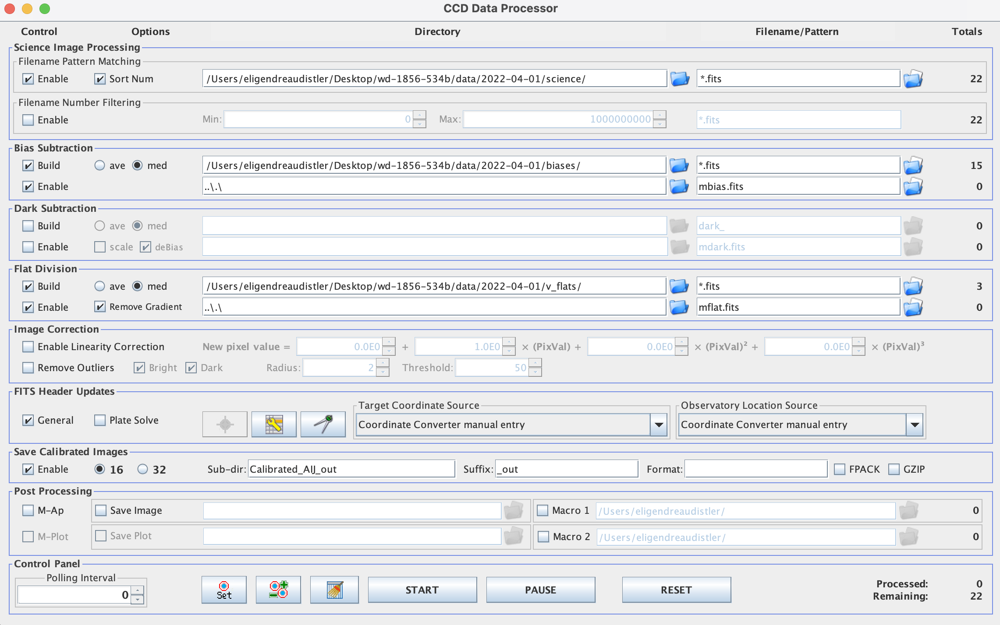
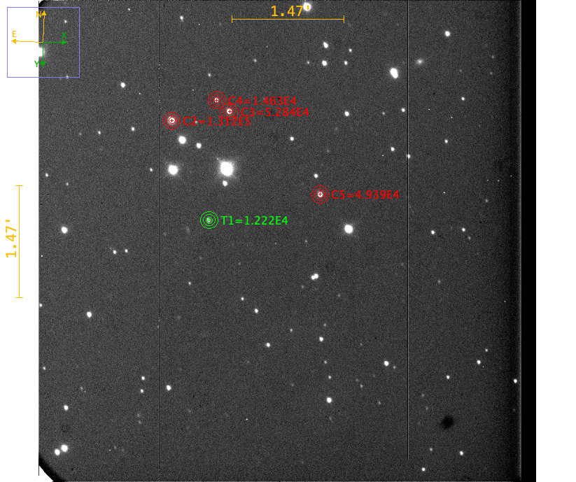
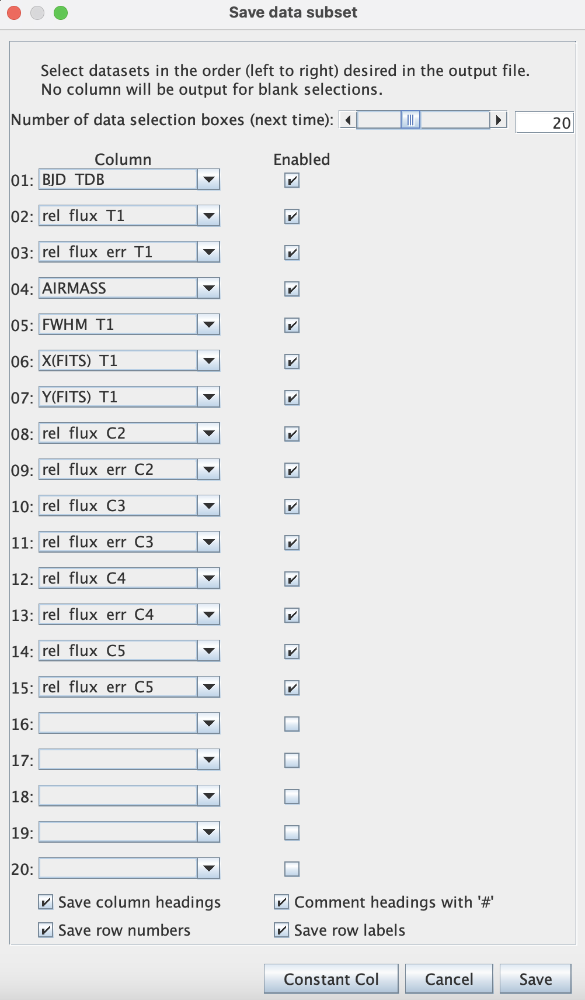
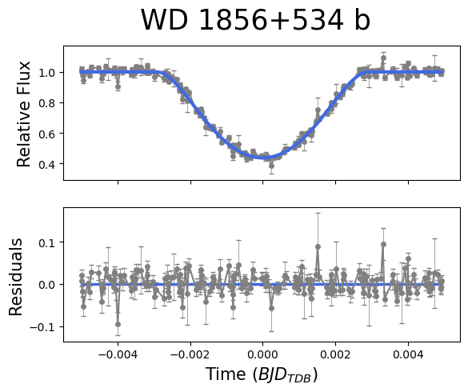

# WD 1856+534 b

## Nickel Data
We observed 20 transits of WD 1856+534 b with the 1m Nickel telescope at Lick Observatory on the following dates. All transits were observed in the R band with 45 second exposures except the 2022-04-02 transit, which was taken in the V band with 45 second exposures, and the 2022-06-03 transit, which was taken in the R band with 120 second exposures. The dates listed below correspond to the morning *after* the observations (rather than the evening before).

- April 2, 2022
- June 3, 2022
- August 1, 2023
- August 15, 2023
- May 14, 2024
- June 7, 2024
- June 14, 2024
- June 24, 2024
- July 1, 2024
- July 8, 2024
- July 15, 2024
- July 25, 2024
- August 8, 2024
- August 15, 2024
- May 18, 2025
- May 25, 2025
- June 8, 2025
- June 18, 2025
- July 2, 2025
- July 19, 2025

## Data Reduction Procedure
- Download flats, biases, and science data from Mount Hamilton data repository (https://mthamilton.ucolick.org/data/)
- Correct FITS file headers with `fits_head.py` to ensure files are readable by AstroImageJ (AIJ)
- Import science image sequence to AIJ and flip through to make sure there are no obvious problems. Go to Process $\to$ Data reduction facility. In DP Coordinate Converter, update the object ID and observatory ID, and check that the RA and DEC coordinates look right. Then make the CCD Data Processor window look like this and click start:

    

- Close AIJ, then reopen and import calibrated files.
- Click target star (or one of similar size) and go to Analyze $\to$ Plot Seeing Profile. Make sure you’re using the right aperture (three rings). If everything looks good, click “Save Aperture.” If needed, you can adjust the aperture size in multi-aperture measurements.
- Go to Analyze -> Multi-Aperture. Adjust aperture size if desired; under good conditions, (10, 18, 28) often works well. Click “Aperture Settings” to adjust CCD gain, CCD readout noise, and CCD dark current (see https://mthamilton.ucolick.org/techdocs/detectors/dewar2/dewar2_frame.html). Note that these three values depend on read speed, and be sure to convert the dark current to e-/pix/sec if reported in e-/pix/hr. Click Place Apertures, position apertures over target and comparison stars (see below), and click enter.

    

- Check multi-plot reference star settings to make sure all comparison stars are good. If not, replace yellow/red comparison stars and rerun.
- Multi-plot Y-data: select which quantities to plot (always use BJD_TDB on x-axis), add lightcurve under “Fit Mode” for target (bottom option in menu), set legend labels, check "Show Error”
- Multi-plot Main: set title and subtitle, select auto X/Y-range under X/Y-Axis Scaling, enter predicted ingress/egress under V. Marker 1/2 and check the boxes to display, click Copy under Fit and Normalize Region Selection to send the predicted ingress and egress to the lightcurve model

- Data Set 1 Fit Settings: enter orbital period and eccentricity (uncheck Circle), enter one host star parameter, check the first boxes in the rows labeled “Linear LD u1” and “Quad LD u2”, check “Auto Update Fit”, and verify that transit duration (t14 hms) is comparable to the expected value (note: AIJ light curve fit is not critical since we'll redo the fit with MCMC)

- Click on Multi-plot Main and save using “save all (with options).” Save the following values to a spreadsheet, then convert the spreadsheet to .csv format with ASCII (Western) encoding. Make sure no decimals get truncated in the spreadsheet (may need to adjust # decimal points in Excel $\to$ Format $\to$ Cells $\to$ Number).

    

## Light Curve Fitting
- `preprocess.ipynb`: load data, plot raw lightcurves, remove outliers, and normalize
- `fit_lightcurves/fit_lightcurve_{date}.ipynb`: fit individual lightcurve with MCMC
- `fit_lightcurves/fit_combined_lightcurve.ipynb`: fit combined lightcurve (including all 20 transits, see below)

    

## Orbital Change
- `linear.ipynb` and `quadratic.ipynb`: fit linear and quadratic orbital growth/decay models and calculate relevant statistics (chi-squared, BIC)
    - No evidence for orbital growth/decay found (i.e., no advantage to using quadratic model over linear model)
- `linear_tess.ipynb` and `quadratic_tess.ipynb`: same as above, but also including TESS data
- `apsidal_precession.ipynb`: fit apsidal precession model with MCMC
    - Find $e=0$ scenario strongly preferred (i.e., no evidence for residual eccentricity)

## Transit Timing Variations
- See README in `ttv_constraints` directory

## TESS Data
- See README in `tess` directory